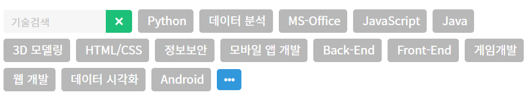

# 1인 가구를 위한 웹사이트

> 큐레이팅 SNS보다는 정보 게시판의 형태에 가깝다보니, 의견이 더 필요함

## 0. 이름

클로저

## 1. 목표

## 2. 구조

> (게시판 / 마이페이지 ) 따로 만드는 이유 - 내가 김호영님이 올리는 글이 졸라 좋음. 구독함. 그럼 편하게 김호영님의 글을 볼 수 있음
>
> 자기가 올리는 글이 차곡차곡 쌓이고 팔로워 수 늘으면 기분 좋아서 열심히 글 작성함

### A. 계정

#### 1. 회원가입, 로그인, 로그아웃

##### a. 회원가입

>회원가입 시 자취를 언제 몇월에 시작했는지 물어봄

- 자취 몇 년 차에요~
- 자취 희망하고 있어요

- 다인가구에요

- 자취러에게만 뱃지 달아주기

- 네이버, 카카오 회원가입, 로그인
- (혹시 가능하면) 로그인 유지, 아이디 저장하기

#### 2. 프로필 페이지

##### a. 뱃지

- 자취 N년차 뱃지
- 활동에 따른 칭호 뱃지
  - 요리사
  - 세스코
  - 애주가 등등

##### b. 내돈내산 자취템 목록

- 공개, 비공개 여부 선택 가능

- 별점

- 한줄평

  - (만약 구매까지 가능한 걸 구현하면) 구매내역이 남으니까 **리뷰 시 기간**도 나오기

- 구매링크

- 피드 형태 (인스타 형식)

  - 사진, 제품명이 간단하게
  - 댓글 달 수 있음

  

##### c. 출석체크

- 2일 연속 출석 -> 또 오셨군요
- 5일 연속 출석 -> 정글링에 푹 빠진
- 출석체크와 커밋 개념을 합침 => 집모양 픽셀:house:로 게시글을 작성하면 하나하나 칠해지도록 구성 커밋 개수에 따라 칭호 증정

##### d. 프로필 페이지

> 마이페이지가 인스타그램같이 자신의 공간을 채워가는 맛이 있도록 만들기

- 인스타그램처럼 정사각형  혹은 브런치처럼 직사각형으로 구성

  - 그림이 있는 글을 쓰면 그림을 가져와 배경으로 두고 글이 제목으로 올라옴

  - 그림이 없는 글을 쓰면 카테고리 아이콘(음식, 살림..)을 가져와서 배경으로 두고 글이 제목으로 올라옴

    

### B. 게시판

#### 1. 메인화면

> 추천 게시글, 큐레이팅 게시글

- 게시글 중 랭킹 top3
- 각 유저 관심사에 따른 카테고리 top2
  - 자기가 가장 좋아요 많이 누르거나 스크랩 많이 한  글 해쉬태그 위주로 게시물을 사용자별로 다르게 띄워줌

#### 2. 글 쓰기

- (사용자) 카테고리로 굳이 이동해서 글 쓸 필요없이 
  - ex) 트위터, 페이스북 처럼 메인에서 바로 글 쓰기 가능

- 글을 쓸 때 해쉬태그 지정 ( 해쉬태그는 우리가 정해줌 - 왜 ? 관리하기 힘드니까 ) 
  - 해쉬태그로 게시판을 분류해서 글이 들어가고 동시에 마이페이지 자신의 피드에도 글이 들어감

#### 3. 전체게시판

> 일반 게시글처럼 하면 좀 딱딱한 느낌? sns느낌이 안날 수도 있을거 같음

- 맨 처음에는 전체 게시글 (인기 / 최신순으로)

- 여러가지 카테고리 중에서 보고 싶은 카테고리만 선택하는 형식

  - 클릭하면 그곳만 색상 들어오고 해당 카테고리 랭킹게시물들로 글이 바뀜

  

  

#### 4. 1인 가구를 위한 게시판

##### a. 공동구매

- 동네별 / 지역상관X
- 1:1 대화

##### b. 긴급 커뮤니티

- 동네별

##### c. 모임 커뮤니티

- 동네별

##### e. 자취방 인테리어 보여주기

---

#### 1. 자유게시판

##### a. 게시판 형식

- 많은 곳들처럼 게시판 형식 VS 트위터 느낌의 게시판
  - 결국 비슷한거 같은데 디자인을 어떻게 할지 고민하면 될듯

##### b. 소분류

> 선택하기

- 글머리
  - 잡담, 질문
- 주제
  - 일상, 요리, 운동 등

##### c. 레시피 공유 게시판

- 혼술, 건강 등 레시피 공유

##### d. 채팅

- 실시간 채팅

- 1대1 채팅

##### e. 실시간 트렌드

- 일주일 정도 기간을 정해서 많이 나오는 키워드 기준으로 트렌드 보여주기

#### 2. 지역별 게시판

##### a. 위치 설정

- 위치 기반 또는 본인 동네 설정

##### b. 게시판 종류

- 정보 공유
  - 맛집, 카페 등 정보 공유
  - 집밥 레시피 정보 공유

- 응급상황
  - 벌레 잡아주세요 등 응급상황

- 공동구매
  - 물물교환, 공동구매 (같은 동네에서 하는게 편하니까 -> 구매 쪽 게시판에 따로할지 의견 나누기)
  - 만나는 장소를 안전하게 할 수 있도록 지침을 제공

- 팟 모집
  - 운동팟, 외식팟 구하기
  - 규약? 같은걸 쓰기

### C. 구매

#### 1. 물품 구매

##### a. 구매

- 장바구니
- 구매
- 기타 등등

##### b. 리뷰

- 해당 리뷰 쓴 사람의 프로필로 넘어가는거 등등

#### 2. 공동 구매

> 이익을 취득하는 사람이 있을 수 있음
>
> -> 한달에 횟수 제한

##### a. 공구 주최자

- 휴대폰 인증

##### b. 공구 인원

- 현재 공구 인원 실시간으로 보여주기
- 공구 인원이 차면, 주최자 및 참가자에게 연락가기

### D. 기타

#### 1. 메인 페이지

- 새로 올라온 글
- 실시간 키워드
- 기타 등등