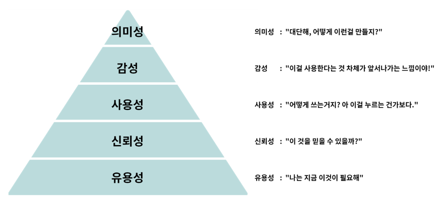
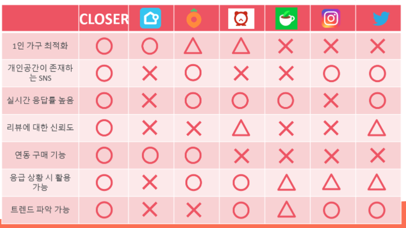
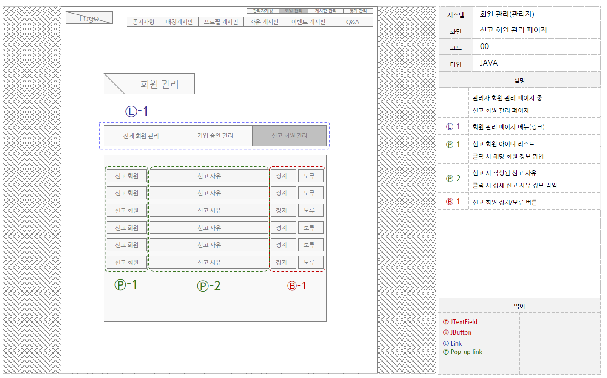
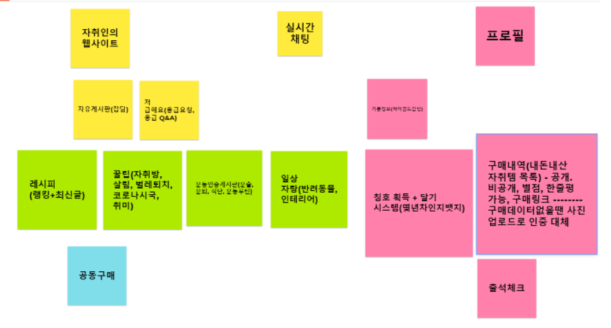

# 0. 디자인 단계

- 1차 프로토타입
  - only 배치
  - 어떤 사진이 어디에 어떤 크기로 들어갈지
  - 어떤 내용이 어디에 어떤 크기로 들어갈지
- 2차 프로토타입
  - 폰트, 색상 설정
  - 애니메이션 설정
  - 사진 가져오기
  - 수정 검토
- 최종 디자인
  - 수정 반영
  - 디테일 다듬기

# 1. 아이템 주제에 대한 사전 조사

- 짚고 넘어갈 것 (우리는 PPT로 대부분 함)
  - 아이템 주제의 특징 파악
    - MZ세대?
  - 비슷한 서비스 찾아보기
    - 아래 표
  - **제일 잘 나가는 서비스 특징**
    - 고민해봐야 할지점!!!!!
  - 우리의 차별점은 무엇인가
    - 1인가구

- 정해야 할 것
  - PC / Mobile 결정
  - 결재 방식은 어떻게
  - 아이디에 대한 보안은 어떻게
  - 우리 서비스의 장점은?

- 현황 조사
  - 해당 기능이 어떤 플랫폼에서 어떤 방식으로 이용되고 있는지
  - 클로저 서비스의 경우 카테고리를 나눠서 조사할 필요가 있음

- 비슷한 서비스에서 모방할 점 가져오기(서비스)

  

# 2. 디자인 영감 얻기

- 비슷한 서비스에서 모방할 점 가져오기(디자인)
- 핀터레스트, Behance, Dribbble, 구글링, 플레이스토어
  - 검색 키워드 : netflix ui redesign, Sharing App ui, Co work app ui...

- 생각해봐야 할 것(대략적으로, 확정짓지 못해도 2차 프로토타입에서 정할 것)
  - 어떤 컨셉(정체성)
  - **어떤 레이아웃(배치) - 당장 1차 프로토타입때 확정이므로 제일 중요**
  - 어떤 색상(색상간 조화 고려)
  - 어떤 문구(캐치프레이즈)
  - 어떤 효과(색상, 애니메이션 등으로 어디를 부각시킬 건지)

# 3. 화면 흐름 짜기

## 화면구조도1 - 메인페이지

- 예시

- 예외처리도 고려할 것! (로그인 안된 상태로 글 작성 시도 등)

## 화면구조도2 - 사용자 마이페이지(전시용 / 정보용)

## 화면구조도3 - 게시판

# 4. 기능명세 작성

- 상황별로 명세 작성

- 예시

## 기능명세

| 분류 | ID   | Depth 1 서비스 | Depth 2 페이지구분 | Depth 3 세부항목 | 주요기능 | 요구사항 |
| ---- | ---- | -------------- | ------------------ | ---------------- | -------- | -------- |
|      |      |                |                    |                  |          |          |
|      |      |                |                    |                  |          |          |
|      |      |                |                    |                  |          |          |
|      |      |                |                    |                  |          |          |
|      |      |                |                    |                  |          |          |
|      |      |                |                    |                  |          |          |
|      |      |                |                    |                  |          |          |
|      |      |                |                    |                  |          |          |
|      |      |                |                    |                  |          |          |

- 주 서비스를 어떻게  구현할지에 대한 토의도 해보기

# 5. [1차프로토타입-와이어프레임]

# 대락적인 레이아웃 잡기

#### 프로토타입 툴

- 화면 설계 / 프로토타입 툴 사용
- 발사믹 목업, **Adobe XD**, 파워포인트 => 와이어프레임 툴
- invision, framer => 프로토타입 툴

#### 레이아웃 잘 짜는 방법

- 구글 https://material.io

- 애플 https://developer.apple.com/design/human-interface-guidelines/

- 디스코드 등 훌륭한 UI 서비스 분석해보기

- 규칙을 발견하자

#### 와이어프레임에서 보여줘야 하는 기본적인 내용

> #### 빠진 기능은 없는지, 개선할 부분은 없는지, 사용자 흐름( 이 화면 다음에 저 화면)이 맞는지에 대한 검증
>
> #### 사용자의 흐름에 불편이 없는지 확인,
>
> #### 개발할 서비스에 대한 구상을 구체화,
>
> #### 팀원 및 이해관계자의 오해를 줄이기

1. 화면에 어떤 정보가 나타나야 하는가?
2. 어떤 레이아웃을 가져야 하는가?
3. 어떤 세부 모습이 나타나야 하는가?
4. 어느 부분과 이어지며 어디로 이어져야 하는가?
5. 네비게이션은 적절히 기능하는가?

(그림 + 다이어그램, 자세한 설명, 주석들)

- ex. 비밀번호를 찾는 시나리오
  - 비밀번호 찾는 화면 -> 비밀번호 변경링크 발송 -> 이메일에서 링크를 클릭 -> 변경화면 -> 변경완료 -> 완료 시 이동할 화면
    을 연계해서 설계하는 것이 중요
- 시나리오를 그려보며 불필요한 단계는 없는지, 혹은 누락된 단계가 없는지 확인이 필요
- 프로그램을 이용해 혹은 손으로 그려서 작성

​	

#### 1차 프로토타입(와이어프레임)을 짤 때 고려해야 할 것

- **우선 그리기**
  - 너무 많은 것을 고민하면 그리는 것이 어려워짐
  - 텍스트 자리만 표시
    - 문구에 너무 집착하지 말 것
    - 와이어 프레임은 문구를 완성하기 위해 작성하는 문서가 아님.
  - 그리는 도중에 더 나은 아이디어가 나오기도 함
  - 초안 단계에서는 뒤늦게 수정하고 싶어도 우선 완성하고 그리는 도중 알게 된 문제점은 그린 후에 다른 색상의 펜을 이요해서 메모하기
  - 개선안이 충분히 작성되었다고 판단되면 해당 개선안이 반영된 와이어프레임 작성하기
- **사용자의 사용 흐름을 상상할 수 있도록 하기**

- 디자인보단 화면 설계 초점 -> 디자인이 포함되면 핵심 가치 파악이 힘들 수 있음\
- 사용자 경험을 고려해 개선한 최종 UI
- **개별 화면별로, 세세하게 (사용자 경험에서 보이는 화면 전부!)**

- 예시

- 참고 자료

  

#### 와이어프레임 상호 체크

- 의견을 받는 동시에 함께 개발할 내용에 대해 서로의 이해도를 높여 더 나은 개선안 도출 가능
- 역할을 바꾸어 보는 것도 한가지 방법
  - 와이어프레임 작성자는 본인도 모르게 본인이 만든 와이어프레임을 변호하게 될 가능성 있음
  - 팀원들이 와이어프레임을 옹호하고 작성자가 부족한 부분에 대한 비평적인 역할을 맡아 회의를 진행
  - 팀원들은 와이어프레임에 대한 이해도가 높아지고, 작성자는 조금 더 입체적인 시각으로 의견 교환을 진행할 수 있음
  - (에드워드 드 보노의 "6가지 생각모자 기법")

#### 와이어프레임 검증

- 검증 단계에서 "문구가 딱딱함, "로그인하러 가기라고 쓰는 것이 더나을듯" 등
  문구와 세부사항에 대해 나온다면
  와이어 프레임이 거의 완성되었다는 것을 의미

# 6. 키 컬러 정하기

- 툴: 포토샵, Sketch(맥)

- 기획해야 할 것

  - Color

    - 고객이 누구인지? 어떤 느낌을 주고 싶은지
- https://seopressor.com/wp-content/uploads/2015/06/colour-culture1.png
    
- Primary color
    - Secondary color
    - Sub color

# 7. [2차 프로토타입]

### - 레이아웃 확정

### - 컴포넌트 정의

- 디자인 프레임워크 이용(필수 아님, 커스텀이 어렵다는 단점)
  - Vuetify, MATERIAL-UI

### - 상세 화면 디자인 및 아이콘 디자인

- App icon
  - 로고
  - 파비콘
  - 의미
- Charactor
- 애니메이션

## 

# 8. [3차 프로토타입]

## [업데이트]이벤트, 부가기능 기획

- 실시간 알림 배지 구현
  - Firebase의 Cloud Firestore

## [업데이트]이벤트, 부가기능 화면구성