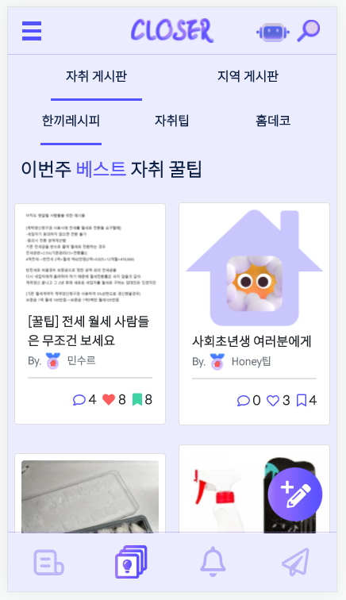
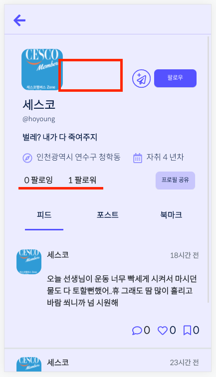
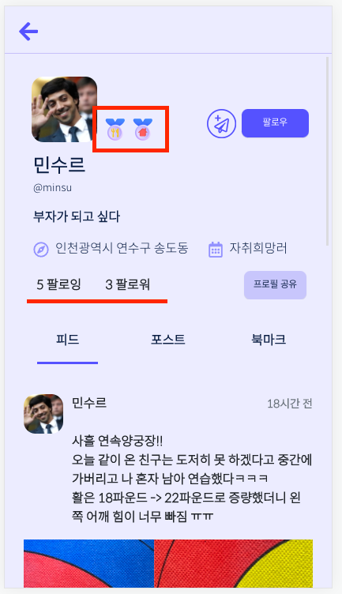
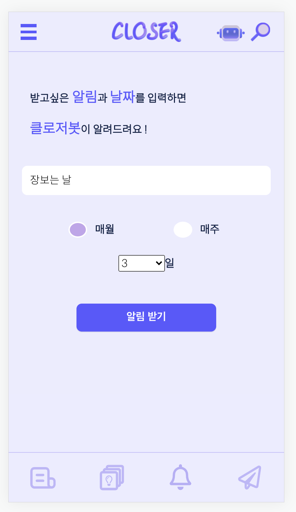
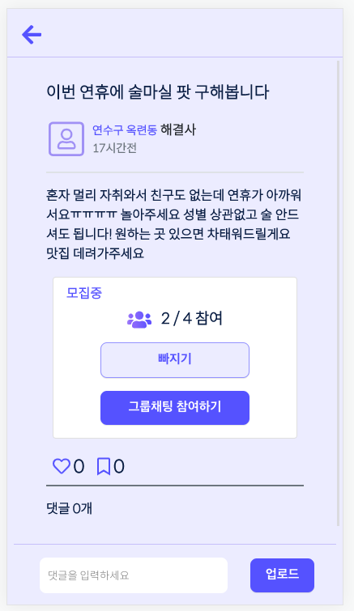
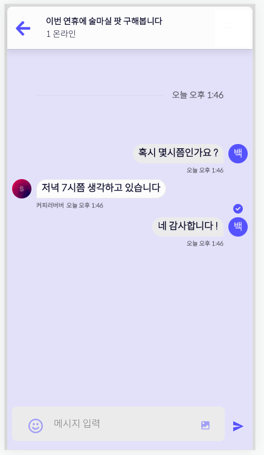

# CLOSER
> 프론트 담당: 김지윤, 서민수
>
> 백엔드 담당: 김호영, 이민지, 조혜인

## 1. 목표

- 웹 큐레이션 SNS 서비스 개발

- 커뮤니티 서비스 구성
- HTML, CSS, JavaScript, React.js, Sprint boot, REST API, MySQL 등을 활용한 실제 서비스 설계
- 서비스 관리 및 유지보수

## 2. 서비스 목적

**자취, 비혼 등 1인가구 비율이 증가하고 있습니다.**

**하지만, 배달, 물품구매부터 시작해서 많은 부분이 다인가구에 맞춰져 있습니다.**  

**1인가구 플랫폼 CLOSER를 통해 1인 가구의 편의성을 증가시키고자 서비스를 만들었습니다.**

> **We are alone but together**
>
> **Shall We Share?**

**CLOSER**

**에서 함께 살아봅시다**

## 3. 준비사항

### A. 아키텍처

#### 1. Back-End

- Spring boot
- MySql

#### 2. Front-End

- React.js

#### 3. 배포

- AWS

## 4. 요구사항

### A. 프로젝트 구조

> 여기서는 폴더 구조 보여주면 돼요! (폴더 구조 캡쳐 등으로 하면 될듯)

#### 1. Back-End

#### 2. Front-End

### B. Model

> 데이터베이스에서 모델의 ERD는 아래와 같습니다.

### C. URL

#### 1. Back-End

> 스웨거에 있는 친구들!!! 
>
> 웬만하면 관련있는 애들끼리 같이 묶어서 해주세요!!
>
> 회원가입 다 쓰고, 그 다음 로그인 관련된 애들 쓰고. 그 다음 로그아웃 관련된 애들 쓰고 이런식으로??
>
> board 같은 경우는 리스트 조회 쓰고, 상세 조회 쓰고, U D 이런 순으로

##### a. User

>- User 컨트롤러의 모든 URL 패턴은 /user 로 시작합니다.
>- 회원가입, 로그인, 프로필 등 계정과 관련된 url입니다.

| HTTP verb | URL 패턴 |            설명            |
| :-------: | :------: | :------------------------: |
|  DELETE   | /user    | 회원탈퇴                           |
| GET          | /user/board/{userId}         |     프로필 페이지 포스트                       |
| GET          | /user/bookmark/{userId}         |     프로필 페이지 북마크                     |
| PUT          | /user/change-location         |     주소 변경                    |
| GET          | /user/feed/{userId}         |     프로필 페이지 피드                    |
| GET/POST          | /user/login         |     로그인 화면으로 이동                   |
| GET          | /user/logout         |     로그아웃                   |
| PUT          | /user/mypage         |     개인정보 수정                   |
| POST          | /user/profileinfo         |     프로필 페이지 정보(내 프로필, 다른 사람 프로필 모두 사용)                   |
| POST          | /user/regist         |  회원가입                 |
| GET          | /user/totalBoard/{userId}         |     해당 유저가 쓴 글 갯수                   |
| POST          | /user/userIdCheck         |     아이디 중복 확인                   |
| POST          | /user/userNicknameCheck     |     닉네임 중복확인       |

##### b. Follow

> - Follow 컨트롤러의 모든 URL 패턴은 /follow 로 시작합니다.
> - 0000000000000 등 계정 팔로우와 관련된 url입니다.

| HTTP verb | URL 패턴 |            설명            |
| :-------: | :------: | :------------------------: |
|   POST    | /follow/{id}/follow  | 팔로우 or 언팔로우 |
|  POST         |     /follow/{id}/follower   |          팔로워 리스트                  |
|      POST     |     /follow/{id}/following     |          팔로잉 리스트                  |

##### c. Alarm

> - Alarm컨트롤러의 모든 URL 패턴은 /alarm로 시작합니다.
> - 0000000000000 등 알람 기능과 관련된 url입니다.

| HTTP verb | URL 패턴 |            설명            |
| :-------: | :------: | :------------------------: |
|   POST    | /alarm  | 알람 리스트 |
|POST|    /alarm/read-all      |   모두 읽음 표시                         |
|POST|   /alarm/unreadCount       |              안읽은 알람 갯수              |
|POST|     /alarm/user_bot/{id}/create     |               봇 알림 생성             |

##### d. Board

> - Board컨트롤러의 모든 URL 패턴은 /board로 시작합니다.
> - 0000000000000 등 게시판 기능과 관련된 url입니다.

| HTTP verb | URL 패턴 |            설명            |
| :-------: | :------: | :------------------------: |
|   POST    | /board  | 신규 사용자 생성(회원가입) |
|     GET/PUT/DELETE      |   /board/{board_pk}       |     게시글 상세 보기, 해당 게시글 수정, 해당 게시글 삭제                      |
|        GET/POST   |   /board/{board_pk}/comment        |      댓글 리스트, 댓글 생성                      |
|        DELETE   |     /board/{board_pk}/comment/{info_pk}     |     특정 댓글 삭제                       |
|        DELETE   |    /board/{board_pk}/delete-image      |        게시판 수정 시 이미지 delete                   |
|        POST   |     /board/{board_pk}/info     |          좋아요, 북마크 클릭 및 정보                  |
|        POST   |     /board/{board_pk}/info-cnt     |         댓글, 좋아요, 북마크 수                   |
|        POST   |    /board/{board_pk}/join      |           지역게시판 모임 참가                 |
|        GET   |     /board/comment/{board_pk}      |                   댓글이 속한 게시판 종류         |
|        GET   |   /board/feed/follow/{page}        |팔로우 한 유저들의 피드글 정보를 반환한다                         |
|        GET   |    /board/feed/near/{page}       |         같은 동네 유저들의 피드글 정보를 반환한다                   |
|        GET   |    /board/feed/total/{page}       |       모든 유저들의 피드글 정보를 반환한다                     |
|        POST   |     /board/gBoard/all      |       자취 게시판 cnt 많은 순으로 게시글 보여줌                     |
|        POST   |     /board/gBoard/deco/best      |      자취게시판 - 홈데코 인기글                     |
|        POST   |     /board/gBoard/deco/new      |       자취 게시판 - 홈데코 최신글                     |
|        POST   |     /board/gBoard/deco/weekbest      |       자취 게시판 - 홈데코 한주 인기글                     |
|        POST   |     /board/gBoard/recipe/best      |       자취 게시판 - 한끼레시피 인기글                     |
|        POST   |     /board/gBoard/recipe/new      |       자취 게시판 - 한끼레시피 최신글                     |
|        POST   |     /board/gBoard/recipe/weekbest      |       자취 게시판 - 한끼레시피 한주 인기글 |
|        POST   |     /board/gBoard/tip/best      |       자취 게시판 - 자취팁 인기글                  |
|        POST   |     /board/gBoard/tip/new      |       자취 게시판 - 자취팁 최신글                     |
|        POST   |     /board/gBoard/tip/weekbest      |       자취 게시판 - 자취팁 한주 인기글                     |
|        POST   |     /board/lBoard/getter      |       자취 게시판 - 클로저모임 최신글                     |
|        POST   |     /board/lBoard/purchase      |       자취 게시판 - 공동구매 최신글                     |
|        POST   |     /board/lBoard/sos      |       자취 게시판 - 도와주세요 최신글                     |

##### e. Search

> - Search컨트롤러의 모든 URL 패턴은 /search로 시작합니다.
> - 0000000000000 등 게시판 검색 기능과 관련된 url입니다.

| HTTP verb | URL 패턴 |            설명            |
| :-------: | :------: | :------------------------: |
|   GET    | /search  | 신규 사용자 생성(회원가입) |
|GET| /search/{kind_pk}/popular         | [인기순] 게시판(GBoard, LBoard) 중 한개 선택 시|
|GET|/search/{kind_pk}/recent          | [최신순] 게시판(GBoard, LBoard) 중 한개 선택 시                           |
|GET|  /search/feed/popular                         |[인기순] 뉴스피드 선택 시 
|GET|    /search/feed/recent                  |[최신순] 뉴스피드 선택 시
|GET|/search/gboard/popular|[인기순] 자취게시판(GBoard) 선택 시
|GET|/search/gboard/recent          | [최신순] 자취게시판(GBoard) 선택 시
|GET|/search/lboard/popular          |[인기순] 지역게시판(LBoard) 선택 시
|GET|/search/lBoard/recent          | [최신순] 지역게시판(LBoard) 선택 시
|GET|/search/popular          | [인기순] 전체게시판 선택 시
|GET|/search/recent          | [최신순] 전체게시판 선택 시

#### 2. Front-End

> - 사용자에게 보여지는 URL입니다.
> - /src/App.js에서 정의합니다.

##### a. User 

> 유저 관련 페이지입니다.

|    Component    |            URL             |        설명        |
| :-------------: | :------------------------: | :----------------: |
|      Login      |           /login           |       로그인       |
|     SignUp      |          /signup           |      회원가입      |
|     Profile     |        /profile/:id        |       프로필       |
|  FollowingList  |    /following-list/:id     |   팔로잉 리스트    |
|  FollowerList   |     /follower-list/:id     |   팔로워 리스트    |
| MyProfileUpdate |      /profile-update       |  유저 프로필 수정  |
|    UserFeed     |   /profile/:id/user-feed   |  유저 피드 리스트  |
|    UserBoard    |  /profile/:id/user-board   | 유저 게시물 리스트 |
|  UserBookmark   | /profile/:id/user-bookmark | 유저 북마크 리스트 |
|  UserLocation   |      /change-location      |   유저 위치 수정   |

##### b. Board

> 피드, 게시물 관련 페이지입니다. 

|     Component     |          URL           |           설명           |
| :---------------: | :--------------------: | :----------------------: |
|     Newsfeed      |       /newsfeed        |         뉴스피드         |
|   NewsfeedList    |    /newsfeed/:name     |    피드 항목별 리스트    |
| NewsfeedWriteForm |   /feed-create-form    |        피드 작성         |
|       Board       |         /board         |          게시판          |
|  BoardSubNavbar1  |    /board/subnav1/     |        자취게시판        |
|  BoardSubNavbar2  |    /board/subnav2/     |        지역게시판        |
|    BoardGlobal    |  /board/subnav1/:name  | 자취게시판 항목별 리스트 |
|    BoardLocal     |  /board/subnav2/:name  | 지역게시판 항목별 리스트 |
|     BoardForm     |  /board-create-form/   |       게시물 작성        |
|  BoardUpdateForm  | /board-update-form/:id |       게시물 수정        |
|    BoardDetail    |   /board-detail/:id    |       게시물 상세        |

##### c. Alarm

> 알림 관련 페이지입니다.

| Component |     URL      |        설명        |
| :-------: | :----------: | :----------------: |
|   Alarm   |    /alarm    |    알림 리스트     |
| AlarmList | /alarm/:type | 알림 항목별 리스트 |
| BotAlarm  |     /bot     | 클로저봇 알림 설정 |

##### d. Search

> 검색 관련 페이지입니다.

| Component |   URL   | 설명 |
| :-------: | :-----: | :--: |
|  Search   | /search | 검색 |

##### e. Message

> 검색 관련 페이지입니다.

|   Component   |         URL         |  설명   |
| :-----------: | :-----------------: | :-----: |
|   Messages    |      /messages      |   DM    |
| OtherMessages |   /Omessages/:id    | 1대1 DM |
| GroupMessages | /messages/:board_pk | 그룹 DM |

##### f. Other

> 검색 관련 페이지입니다.

| Component |  URL   |                 설명                 |
| :-------: | :----: | :----------------------------------: |
|   About   | /about | 비회원 제한 기능 사용 시 연결 페이지 |

## 5. 세부사항
> 시연시나리오는 exec 폴더 밑에서 진행할거에요!! 어차피 같은 깃안에 있으니까 굳이 여기 다시 안넣어도 될거 같긴합니다. 그러나 뭔가 지금 세부사항할때 사진있으면 좋을거 같다 하면 여기에 기능에 관련된 사진은 넣으면 좋을거 같아요!!!!!

### A. 뉴스피드 기능 

+ 피드 목록 
    

> Near : 나와 같은 동네 유저가 쓴 글 

    

> Favorite : 내가 좋아요 한 유저가 쓴 글 

       

> All : 동네 구분 없이 모든 유저가 쓴 글 

+ 피드 작성 

> 피드 글작성    

> 피드 글 작성 완료  
---  
### B. 게시판 기능  
+ 자취 게시판 : 자취 꿀팁을 서로 공유할 수 있는 게시판    

> 좋아요 + 댓글이 많은 순서대로 인기 게시물 

+ 지역 게시판 : 우리 지역 내에서 모임을 모집할 수 있는 게시판 

> 1인 가구가 사용하기엔 많은 물건을 같은 동네 자취생들과 나눌 수 있는 공동구매 게시판    

> 같은 동네 자취생들끼리 원하는 모임을 개설하고 인원을 모집할 수 있는 클로저모임 게시판  

> 급하게 필요한 게 있거나 위험한 상황일 때 주변의 자취생들에게 부탁을 요청할 수 있는 도와주세요 게시판  

---  
### C. 게시물 검색 기능 + 네이버 검색 활용 

> 네이버 검색 기능을 활용한 검색 기능 

> 네이버 검색 기능 미포함 클로저 게시물 검색 기능 

> 유저 닉네임 검색을 통한 게시물 검색 기능 

---  
### D. 프로필 기능

> 내 프로필에서 나의 정보와 내가 쓴 글, 북마크 한 글 확인 가능  

> 글 개수가 일정 수준 도달 하지 못하면, 뱃지 부여 X

> 글 개수 일정 수준 도달하면, 뱃지 부여 O 

---
### E. 네이버 지도 API를 활용한 위치 변경

> 동네가 변경되었을 때, 현재 위치를 기반으로 위치 변경 가능 

---
### F. 팔로우/언팔로우 기능  

> 다른 유저 팔로우 하기 전 모습 

> 팔로우 시작 

> 팔로워 리스트 변경 

---
### G. 알림 기능 

> 다른 유저가 나의 글을 좋아요, 북마크를 하거나 댓글을 달면 알림 수신  
---  
### H. 클로저봇 알림 기능 

> 클로저봇 알림을 통해 매주, 매월 해야 하는 일정을 적어  

> 알림 수신 가능  
---  
### I. DM 기능  

> 다른 유저와 1:1 대화 기능 (상대방 프로필에서 dm 버튼 눌렀을 시)

> 지역게시판 클로저모임에서, 대화 참여가능 

> 대화 입장하여 모집 인원들과 대화 가능 

## 6. 발전방향

> 여기에는 저희가 하지 못했거나, 이런 걸 더 추가하면 좋겠다! 하는 기능들을 넣으면 좋을거 같아요

