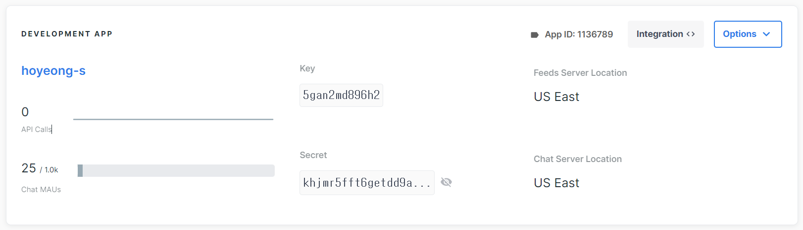
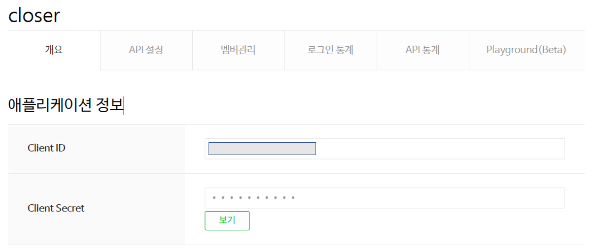
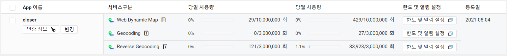
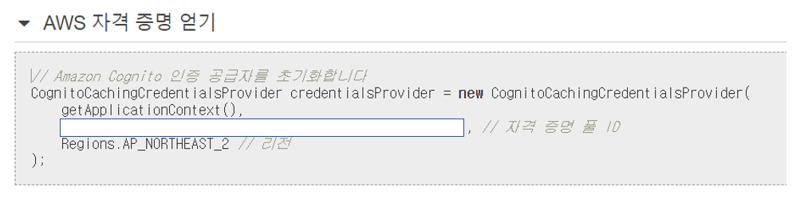

# 2. 프로젝트에서 사용하는 외부 서비스 정보 문서

> 소셜 인증, 포톤 클라우드, 코드 컴파일 등에 활용된 '외부 서비스' 가입 및 활용에 필요한 정보

##### A.  getstream api (Chat api)



- [현재 2021.09.02 기준으로 만료되는 Key, Secret을 사용하고 있습니다.]

  

##### B. 네이버 검색 api  




##### C. 네이버 지도 api   

- Web Dynamic Map : 현재 위치 위도, 경도 반환 

- Reverse Geocoding: 위도, 경도 기준으로 주소 반환



```javascript
Application 이름 : Closer
Client ID (X-NCP-APIGW-API-KEY-ID) : [Client ID]
```


##### D. AWS.S3

```javascript
var s3 = new AWS.S3({
    apiVersion: "2006-03-01",
    params: { Bucket: [BucketName] },
  });
```


##### E. AWS.Cognito



